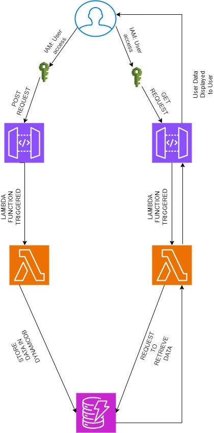

# PROJECT NEBULA

## Overview
Nebula is a comprehensive platform designed to manage and visualize student data. It includes functionalities such as user management, real-time data display, and automated notifications.

## Features
- User login and registration
- Real-time dashboard with user statistics
- Automated notifications
- API endpoints for data retrieval and management

## Technology Stack
- **Frontend**:HTML, CSS ,JS ,JSX, PHP.
- **Backend**: Python, Flask
- **Database**: AWS DynamoDB
- **Notifications**: AWS SNS
- **API Management**: AWS API Gateway
- **Serverless Functions**: AWS Lambda

 Installation and Setup

## Prerequisites
- Python 3.12.5
- AWS CLI
- Docker (for deployment)-ECR

## Setup Instructions
1. **Clone the Repository**
   ```bash
   git clone https://github.com/regy10/GoldGridApp.git

# Project Management

## Roadmap
- [ ] User login by username and password
- [ ] Add user analytics dashboard
- [ ] Implement advanced search features
- [ ] SNS send notifications after user has been created by trigger lamda function
## Current Issues
- Issue #1: User data count not display on dashboard

## Cost optimaziong Approach.

 1. ## Infrastructure Costs
    - ## AWS DynamoDB:
       - Read and Write Capacity: Provisioned capacity can be more cost-effective if you have a predictable   load. Costs are based on the number of read and write operations.
    - ## Storage:
      - Costs are based on the amount of data stored.
    - ## AWS SNS (Simple Notification Service):
       - ## Email Sending: 
           -Costs are based on the number of emails sent. The first 62,000 emails per month are free if sent from an application hosted in Amazon EC2 or AWS Lambda.

    
2. # Development Costs
  -  ## Development Time: 
      - Assuming a small team working for a few weeks, development costs will include salaries or contractor fees.
3. # Budget Estimate (for a small to medium-scale project):
   - ## DynamoDB:
      -  $100 - $300 per month
   - ## AWS SNS: 
      -   $10 - $50 per month (after free tier)

   - ## Development:
      - $500 - $2,000 (depending on team size and duration)
   - ## Total Estimated Cost (Monthly):
     -  $100- $500 
   - ## Total Estimated Development Cost:
      -  $500 - $2000
4. # Architecture diagram of the Project
     - 

   
5. # Use case
     ## Students Management system
       - Purpose: Track students' performance, attendance, and  progression.
      -  Users: Admins, instructors, students.
     ## Functionality:
      - Register/login students.
      - Record and display academic performance.
      - Real-time updates on students' status.
      - Automated notifications (via AWS SNS) for attendance and performance.
      - Performance Analytics Dashboard:
      - Visualize cohort performance.
      - Generate reports on academic metrics (assignments, attendance).
      - Advanced search for student data.
      - Trigger Lambda functions to send automated notifications upon new student registration.
      - Automated Notifications for Cohort Activity:
      - Access real-time student statistics via API Gateway and Lambda.